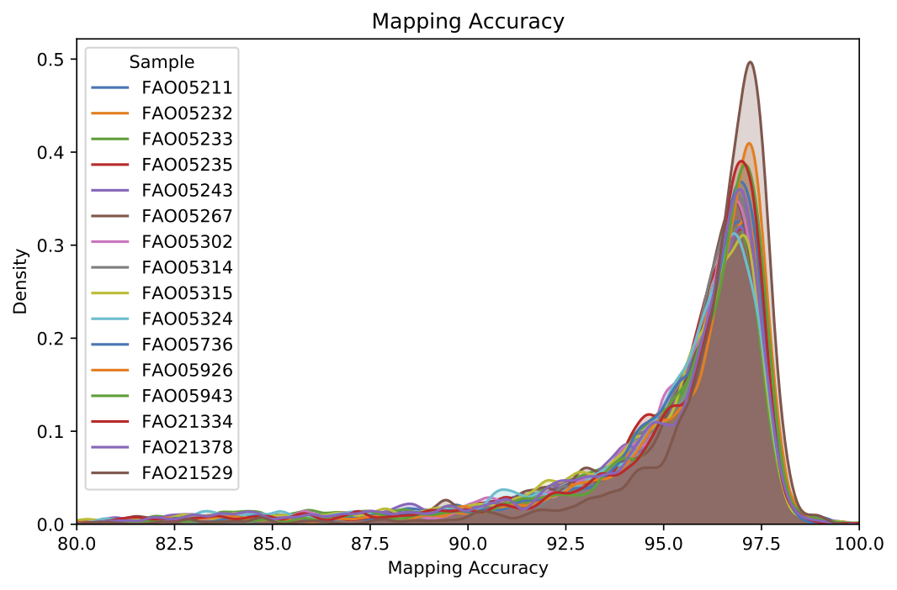
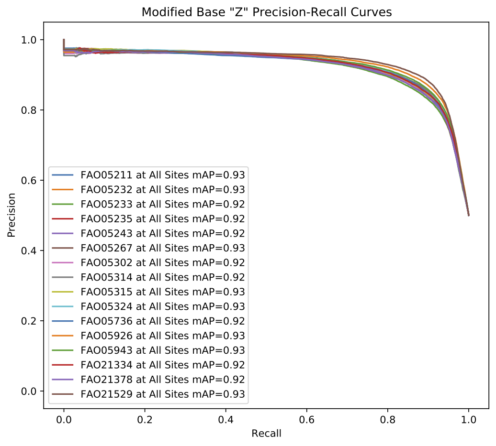
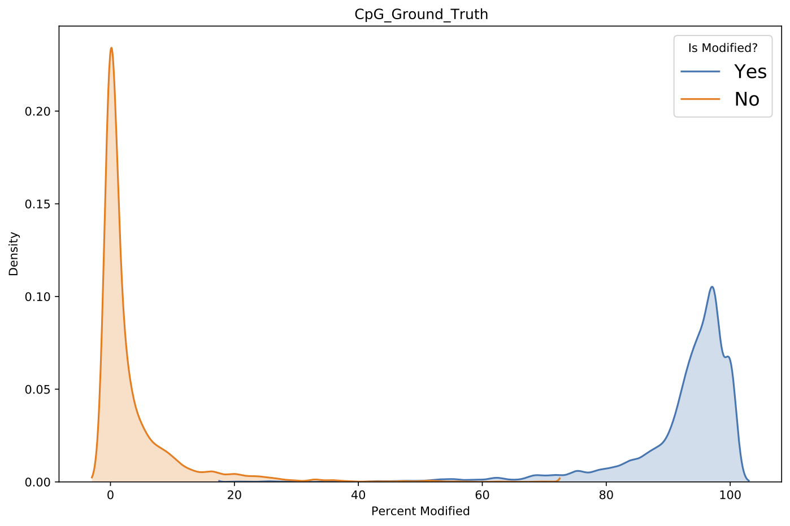

*****************************
``megalodon_extras validate``
*****************************

The ``megalodon_extras validate`` command group contains commands to validate mapping and modified base outputs from Megalodon.
Note that scripts to validate sequence variants are not provided here.
Other tools including `vcfeval <https://github.com/RealTimeGenomics/rtg-tools>`_ and `hapy.py <https://github.com/Illumina/hap.py>`_ are recommended for validation of sequence variant results.

-------------------------------------
``megalodon_extras validate results``
-------------------------------------

Validate per-read mapping and modified base results.

This command produces text and graphical summaries of mapping and modified base performance.

Mapping results include distributional statistics for each sample provided (output determined by ``--out-filename`` default ``stdout``), as well as a plot showing the distribution of mapping accuracy for each sample (see ``--out-pdf``).

----

   Example ``validate results`` per-read mapping plot.

----

Per-read modified base results require a per-read ground truth for modified and canonical bases.
This can be provided by either 1) supplying a control sample via the ``--control-megalodon-results-dirs`` argument (assumes all modified base calls at ``--valid-sites`` in main Megalodon results are modified) or 2) providing a ground truth set of sites containing modified and canonical bases via the ``--ground-truth-data`` argument.
See the ``megalodon_extras modified_bases create_ground_truth`` command for help generating a ground truth file.

Per-read modified base results are analyzed to produce several metrics including the optimal `F1-score <https://en.wikipedia.org/wiki/F1_score>`_, `mean average precision <https://en.wikipedia.org/wiki/Evaluation_measures_(information_retrieval)#Mean_average_precision>`_ and `ROC AUC <https://en.wikipedia.org/wiki/Receiver_operating_characteristic>`_ among others.
By default, modified and canonical ground truth sites are filtered to contain the same number of statistics for these statistic computations.
It is highly recommended that this not be changed (via ``--allow-unbalance-classes``) as class imbalance can have a large effect on the statistics, thus effecting their comparison between runs and/or models.
Below are example graphical representations produced for per-read modified base validation.

----

   Example ``validate results`` per-read modified base precision-recall curve plot.

.. figure::  _images/mod_roc_validate_results.png
   :align: center
   :width: 600

   Example ``validate results`` per-read modified base ROC curve plot.

.. figure::  _images/mod_dist_validate_results.png
   :align: center
   :width: 600

   Example ``validate results`` per-read modified base score distribution plot.

----

-------------------------------------------------------
``megalodon_extras validate aggregated_modified_bases``
-------------------------------------------------------

Compute validation metrics and visualizations from aggregated modified base calls.

Similar to the ``megalodon_extras validate results`` command, modified base results are compared to a ground truth provided either by 1) a control sample or 2) a ground truth positions CSV file.
A set of metrics are also reported and stored as described by the ``--out-filename`` argument (default ``stdout``).
These metrics include the optimal F1-score, mean average precision and ROC AUC.
This command outputs several visualizations similar to the per-read modified base validation including modified base percent distributions as well as precision-recall and ROC curves.

----

   Example ``validate aggregated_modified_bases`` modified base percentage distribution plot.

----

----------------------------------------------------
``megalodon_extras validate compare_modified_bases``
----------------------------------------------------

Compare two sets of bedmethyl files and report a standard set of metrics and visualizations.

The two sets or individual bedmethyl files provided will be compared at all overlapping sites with sufficient coverage (defined by ``--coverage-threshold``; default all sites).
To aggregate forward and reverse strand methylation calls set the ``--strand-offset`` argument.
For example to aggregate CpG calls add the ``--strand-offset 1`` argument to the command.

The first metrics reported concern the coverage over the two samples before and after the overlap and coverage filters have been applied.
Overlapping percent modified values are then compared to produce the correlation coefficient, R^2 and RMSE (for the model y=x).
The correlation coefficient has previously been reported as the standard metric for modified base detection performance, but the RMSE is recommended for purposes of model selection or general modified base detection performance.
This is due to potential modified base model issues resulting in low accuracy, but high precision, which can result in high correlation.
Specifically, some models have a tendency to call some low portion of ground truth modified sites as canonical, likely due to training set imbalance.

This command also produces a standard set of visualizations for the comparison of these aggregated results.
Shown below are plots comparing the percent modified bases between nanopore and ENCODE bisulfite runs (on log and linear scales shading) as well as a comparison of the coverage for the two samples.

----

.. figure::  _images/mod_agg_comp_log.png
   :align: center
   :width: 600

   Example ``validate compare_modified_bases`` percent modified comparison with log-10 scaled shading.

.. figure::  _images/mod_agg_comp_linear.png
   :align: center
   :width: 600

   Example ``validate compare_modified_bases`` percent modified comparison with clipped linear scaled shading.

.. figure::  _images/mod_agg_comp_cov.png
   :align: center
   :width: 600

   Example ``validate compare_modified_bases`` modified base sample read coverage comparison.

----
