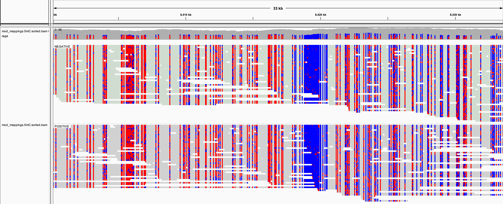

************
File Formats
************

This page describes the output file formats produced by ``megalodon``.

------------
Base Calling
------------

Basecalling produces either FASTQ or FASTA formats.
Basecalls will be output into the ``basecalls.fastq`` or ``basecalls.fasta`` file within the ``--output-directory``.

Basecall anchored modified base calls are output into a custom HDF5 format (similar to the guppy output format described on the community page).
The HDF5 format contains a single data set, ``mod_long_names`` at the root level which contains the modified base long names as described in the model used for calling.
The ``Reads`` group contains all of the per-read modified base scores.
Within this group each reads modified base scores are stored in a data set indexed by the read_id.
This data set contains an array with dimensions ``basecall length`` by ``number of modified bases``.
Unlike the guppy output, scores are only recorded where applicable given the basecall made (e.g. 5mC calls are only output at canonical C basecall positions).
Invalid positions are represented with a ``NAN`` value.
Note that the modified base scores outside of the dependent canonical contexts are not effected during training, so these values should not be used from the guppy output.

-------
Mapping
-------

Mapped reads can be output in SAM, BAM or CRAM formats.
Basecalls will be output into the ``mappings.sam``, ``mappings.bam``, or ``mappings.cram`` file within the ``--output-directory``.

~~~~~~~~~~~~~~~
Variant Mapping
~~~~~~~~~~~~~~~

In addition to standard mapping files, megalodon includes a special mapping-style output with specific relevance to the variant calling pipeline.
This format can be output as a SAM, BAM or CRAM file as with standard mapping format (as specified by the ``--mappings-format`` argument).
The mapped reads in this output represent only the information about proposed variants contained within each read.
Each read includes the mapped reference bases with only the called variants annotated.
The score for each call is encoded in the base quality scores for each read.
Bases without a proposed variant will contain a quality score of ``40``.
Note that storage of insertion probabilities is not supported by the SAM/BAM format, so these score are lost in this format.
This output is useful for 1) producing more accurate variant phasing and read haplotagging via whatshap and 2) visualizing per-read variant calls in a genome browser.

~~~~~~~~~~~~~~~~~~~~~
Modified Base Mapping
~~~~~~~~~~~~~~~~~~~~~

This option will output a file for each modified base represented in the basecalling model.
This format can be output as a SAM, BAM or CRAM file as with standard mapping format (as specified by the ``--mappings-format`` argument).
The mapped reads in this output represent only the information about modified bases contained within each read.
Each read includes the mapped reference bases with only the called modified bases annotated.
The quality score for each called base (whether called as modified or canonical) represent the probability of a modified status and not the canonical base probability (as specified by the SAM format).
Bases without a proposed modified base will contain a quality score of ``40``.

In addition, the ``--mod-map-base-conv`` is provided to modulate the bases output by this format.
This is option useful since the BAM format does support modified bases and will convert all alternative bases to ``N``s for storage in BAM/CRAM format.
For example, to mimic bisulfite output use: ``--mod-map-base-conv C T --mod-map-base-conv Z C``
This can then be visualized by a genome browser as with standard bisulfite data.

----



   Genome browser visualization. Megalodon mod_mappings output.

----

Note modified base formats recently specified by hts-specs (``MM`` and ``ML`` tags) are in planning to be included in a future release.

-----------------------
Per-read Modified Bases
-----------------------

~~~~~~~~
Database
~~~~~~~~

The primary output for per-read modified base results is an `sqlite database <https://www.sqlite.org/index.html>`_.
This database contains an indexed table with per-read, per-position, modified base scores, as well as auxiliary tables with read, modification type and reference position information.
The read table (``read``) contains the read UUID.
The modification type table (``mod``) contains the single letter modified base code, the location sequence match motif, the raw (including ambiguous bases) motif, and the relative modified base position within the motifs.
The reference position table (``pos``) contains the mapped 0-based position, strand (1=forward, -1=reverse) and chromosome (via a final ``chrm`` table which contains the chromosome text).

This database may be accessed via the ``megalodon.mods.ModsDb`` object.

~~~~~~~~~~~~~
Tab-delimited
~~~~~~~~~~~~~

Modified bases results are also available via tab-delimited text output.
This output can be requested via the ``--write-mods-text`` flag.
This output contains the following fields: ``read_id``, ``chrm``, ``strand``, ``pos``, ``mod_log_prob``, ``can_log_prob``, ``mod_base``, ``motif``

-------------------------
Aggregated Modified Bases
-------------------------

The default aggregated modified base output is the bedMethyl format (`description here <https://www.encodeproject.org/data-standards/wgbs/>`_).
Alternative formats are `wiggle <https://genome.ucsc.edu/goldenPath/help/wiggle.html>`_ (variableStep) and VCF (treating the modified base as if it were a sequence variant).

--------------------------
Per-read Sequence Variants
--------------------------

As with the modified base results, the primary output for per-read sequence variant results is as `sqlite database <https://www.sqlite.org/index.html>`_.
This database contains an indexed table with per-read, per-position, variant scores, as well as auxiliary tables with read, reference location and alternative allele information.

The reference location table (``loc``) contains the mapped 0-based position, strand (1=forward, -1=reverse) and chromosome (via a final ``chrm`` table which contains the chromosome text).
The ``loc`` table also contains the location for the start and end of the tested positions (applicable for insertions/deletions).
For example, insertions generally require a context base for downstream processing, but within megalodon only the inserted position is considered (without context).
Each reference location is linked to the IDs linked with this location from the input variants file.
Finally the reference sequence for the location is included in this table.
In the related ``alt`` table, each alternative sequence is stored.
Links between alternative sequences and reference locations are made via the main ``data`` table.

The ``read`` table contains the read UUID as well as the mapped strand for each read.

----------------------------
Aggregated Sequence Variants
----------------------------

Sequence variant calls are output in standard VCF format (version 4.1).
The sample format fields includes the following standard VCF fields: ``gt``, ``gq``, ``gp``, ``gl``, and ````pl``
In addition the non-standard ``log_probs`` field, containing the per-read contributions to the variant call, can be added to the VCF file by setting the ``--write-vcf-log-probs`` flag.
