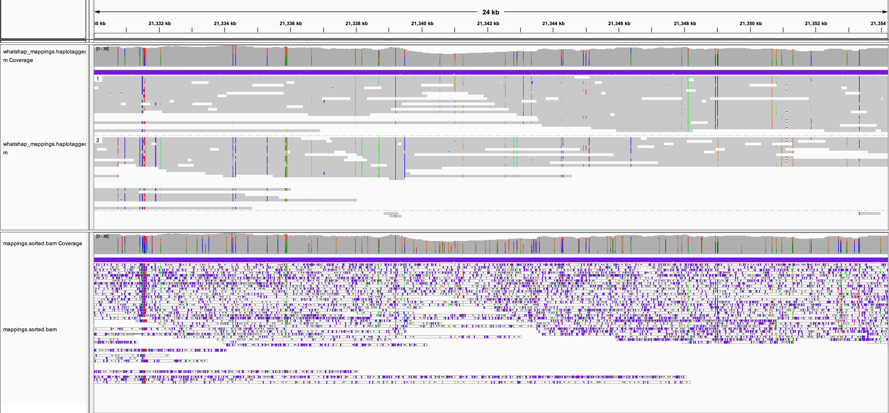

***************
Variant Phasing
***************

This page walks through the steps to use megalodon in conjunction with `whatshap <https://whatshap.readthedocs.io/en/latest/>`_ to produce the highest quality phased variant calls.

This pipeline produces the ``variants.haploid_merged.vcf`` file containing high quality phased variant calls.
The intermediate ``whatshap_mappings.haplotagged.bam`` file can be of particular interest to investigate variant calls at the per-read level.
This file contains the reference sequence for each read annotated only with the proposed variant calls, including quality scores for SNVs.
Thus random read errors are masked allowing for more accurate analysis on proposed variants.
See an example of this per-read variant genome browser visualization below.

----

   Genome browser visualization. Megalodon whatshap_mappings haplotagged with whatshap (upper panel) and raw read mappings (lower panel).

----

--------
Workflow
--------

::

   reads_dir="fast5s"
   ref="reference.fasta"
   variants_vcf="variants.vcf.gz"
   out_dir="megalodon_results"
   nproc=16
   gpu_devices="0 1"

   # run megalodon to produce whatshap_mappings
   megalodon \
       $reads_dir --outputs mappings variants whatshap_mappings \
       --reference $ref --variant-filename $variants_vcf \
       --output-directory $out_dir \
       --processes $nproc --devices $gpu_devices \
       --verbose-read-progress 3

   # filter whatshap incompatible variants and create indices
   python \
       megalodon/scripts/filter_whatshap.py $out_dir/variants.sorted.vcf \
       $out_dir/variants.sorted.whatshap_filt.vcf \
       --filtered-records $out_dir/whatshap_filt.txt
   bgzip $out_dir/variants.sorted.whatshap_filt.vcf
   tabix $out_dir/variants.sorted.whatshap_filt.vcf.gz
   samtools index $out_dir/whatshap_mappings.sorted.bam

   # run whatshap with produced mappings and variants
   whatshap \
       phase --distrust-genotypes \
       -o $out_dir/variants.phased.vcf \
       $out_dir/variants.sorted.whatshap_filt.vcf.gz \
       $out_dir/whatshap_mappings.sorted.bam

   # assign haplotypes to reads
   bgzip $out_dir/variants.phased.vcf
   tabix $out_dir/variants.phased.vcf.gz
   whatshap \
       haplotag $out_dir/variants.phased.vcf.gz \
       $out_dir/whatshap_mappings.sorted.bam \
       -o $out_dir/whatshap_mappings.haplotagged.bam

   # extract haplotype reads and call haploid variants
   python \
       megalodon/scripts/extract_haplotype_read_ids.py \
       $out_dir/whatshap_mappings.haplotagged.bam \
       $out_dir/whatshap_mappings
   python \
       megalodon/scripts/run_aggregation.py \
       --megalodon-directory $out_dir --output-suffix haplotype_1  \
       --read-ids-filename $out_dir/whatshap_mappings.haplotype_1_read_ids.txt \
       --outputs variants --haploid --processes $nproc
   python \
       megalodon/scripts/run_aggregation.py \
       --megalodon-directory $out_dir --output-suffix haplotype_2  \
       --read-ids-filename $out_dir/whatshap_mappings.haplotype_2_read_ids.txt \
       --outputs variants --haploid --processes $nproc

   # merge haploid variants to produce diploid variants
   python \
       megalodon/scripts/merge_haploid_variants.py \
       $out_dir/variants.sorted.vcf.gz \
       $out_dir/variants.haplotype_1.sorted.vcf.gz \
       $out_dir/variants.haplotype_2.sorted.vcf.gz \
       --out-vcf $out_dir/variants.haploid_merged.vcf
